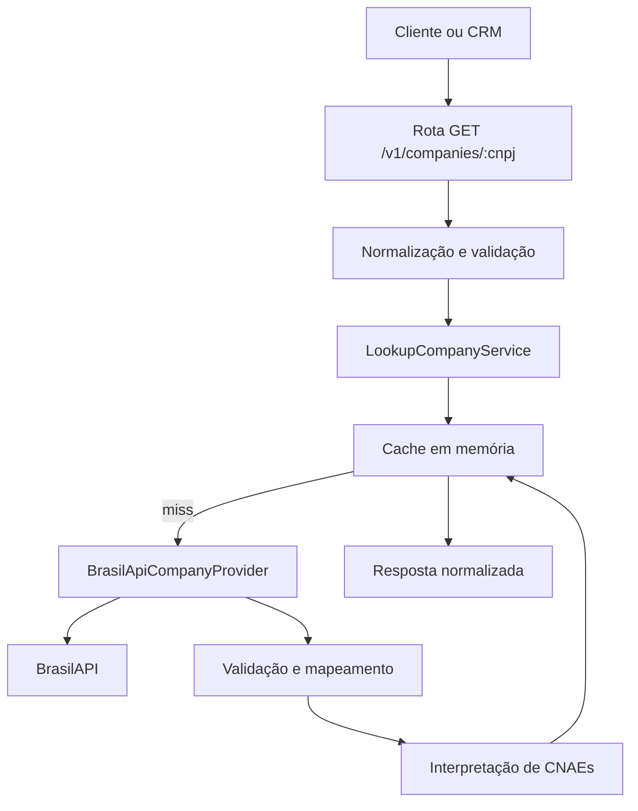

# Especificação técnica — Company Lookup API

**Status:** pronta para revisão  
**Versão:** 1.0  
**Data:** 12 de setembro de 2026  
**Tipo:** projeto de estudo publicável  
**Escopo:** API stateless de consulta, normalização e interpretação cadastral de empresas brasileiras

## 1. Visão geral

A **Company Lookup API** será uma API HTTP construída com Node.js e TypeScript. Ela receberá um CNPJ, consultará um provedor externo de dados empresariais, validará a resposta em tempo de execução e devolverá um contrato próprio, estável e adequado ao preenchimento inicial de um formulário de cadastro.

O primeiro consumidor imaginado é o futuro CRM para oficinas mecânicas. Ao informar o CNPJ da oficina, o front-end poderá preencher razão social, nome fantasia, contato, endereço e atividades econômicas. A criação da empresa, do tenant, dos usuários e dos demais registros continuará sendo responsabilidade exclusiva do CRM.

A API também interpretará os CNAEs retornados para indicar se a empresa possui atividades relacionadas a oficinas automotivas, informando quais atividades justificaram essa classificação. Essa interpretação é apenas um auxílio cadastral; não é validação jurídica, fiscal ou autorização de funcionamento.

## 2. Problema

Digitar manualmente os dados cadastrais de uma oficina:

- aumenta o tempo de onboarding;
- favorece erros de digitação;
- produz endereços, telefones e CNAEs em formatos inconsistentes;
- obriga cada consumidor a conhecer o formato específico do provedor externo;
- acopla o CRM diretamente à disponibilidade e ao contrato da BrasilAPI.

A solução será uma camada intermediária pequena, com contrato próprio e responsabilidades bem delimitadas.

## 3. Objetivos

### 3.1 Objetivos funcionais

1. Receber um CNPJ em uma rota HTTP.
2. Remover formatação permitida e normalizar o identificador.
3. Validar formato e dígitos verificadores conforme as regras vigentes do CNPJ.
4. Consultar a BrasilAPI por meio de um adaptador substituível.
5. Validar estritamente a resposta externa antes de utilizá-la.
6. Transformar os campos externos em um contrato interno consistente.
7. Normalizar endereço, telefone, datas, situação cadastral e CNAEs.
8. Interpretar CNAEs relacionados a serviços de oficina.
9. Armazenar consultas recentes em cache de memória com TTL e capacidade limitada.
10. Publicar documentação OpenAPI e exemplos de uso.
11. Retornar erros previsíveis, estáveis e sem detalhes internos sensíveis.

### 3.2 Objetivos de aprendizagem

O projeto deve permitir praticar, de maneira visível e sem as abstrações do NestJS:

- ciclo de vida de uma aplicação Node.js;
- módulos ES e TypeScript;
- servidor HTTP com Fastify;
- composição manual de dependências;
- consumo de APIs com `fetch` nativo;
- cancelamento com `AbortSignal.timeout`;
- validação em runtime com Zod;
- separação entre domínio, aplicação e infraestrutura;
- cache, TTL e política de remoção;
- logs estruturados;
- tratamento de erros assíncronos;
- testes unitários, de integração e de contrato;
- graceful shutdown;
- Docker e integração contínua.

### 3.3 Critérios de sucesso do projeto

O projeto será considerado concluído quando:

- os endpoints definidos nesta especificação estiverem implementados;
- a API nunca devolver diretamente o payload bruto da BrasilAPI;
- consultas repetidas puderem ser atendidas pelo cache;
- entradas inválidas forem recusadas antes de chamar o provedor;
- respostas externas incompatíveis forem detectadas em runtime;
- a interpretação de CNAEs possuir testes explícitos;
- testes, lint, typecheck e build passarem no CI;
- a documentação permitir executar e testar o projeto do zero;
- nenhum banco de dados, autenticação ou regra de tenant tiver sido introduzido.

## 4. Fora do escopo

A versão 1 não deverá implementar:

- cadastro ou persistência de empresas;
- PostgreSQL, Redis ou qualquer banco de dados;
- criação de tenant;
- usuários, login, JWT ou autorização;
- integração direta com o CRM;
- tela web ou aplicativo front-end;
- consulta por CPF;
- consulta de veículos por placa;
- tabela FIPE;
- emissão de documentos ou comprovantes;
- consulta em massa, crawling ou varredura de CNPJs;
- filas, workers ou tarefas agendadas;
- múltiplos provedores ou fallback automático;
- painel administrativo;
- métricas empresariais, score de crédito ou validação fiscal;
- decisão legal de que uma empresa pode operar como oficina.

## 5. Princípios de projeto

### 5.1 Contrato próprio

O consumidor dependerá do contrato da Company Lookup API, e não do formato da BrasilAPI. Mudanças no provedor devem ficar contidas no adaptador e no mapeador.

### 5.2 Stateless

Cada requisição poderá ser processada por qualquer instância. O cache em memória é apenas uma otimização local e descartável, não uma fonte de verdade.

### 5.3 Falhar de forma explícita

Uma resposta externa inesperada não deverá ser parcialmente aceita. A validação falhará e a API responderá com erro controlado de dependência externa.

### 5.4 Escopo mínimo terminável

A V1 resolve somente consulta, normalização e interpretação. Recursos do CRM não serão antecipados.

### 5.5 Privacidade por padrão

Logs não deverão registrar payloads completos, telefones, e-mails nem endereços. O CNPJ poderá ser registrado de forma mascarada ou associado a um hash de correlação.

## 6. Stack técnica

| Área | Tecnologia | Finalidade |
| --- | --- | --- |
| Runtime | Node.js em versão LTS ativa | Execução da aplicação |
| Linguagem | TypeScript com modo estrito | Tipagem e estudo da plataforma |
| Módulos | ESM | Modelo moderno de módulos do Node |
| HTTP | Fastify | Rotas, schemas, hooks e testes por injeção |
| Validação | Zod | Validação de ambiente e payload externo |
| Logs | Pino, integrado ao Fastify | Logs estruturados |
| Testes | Vitest | Testes unitários e de integração |
| Documentação | `@fastify/swagger` e `@fastify/swagger-ui` | OpenAPI e interface de exploração |
| Qualidade | ESLint e Prettier | Padronização estática |
| Container | Docker | Execução reproduzível |
| CI | GitHub Actions | lint, testes, typecheck e build |

Não usar NestJS, Axios, ORM, Redis nem biblioteca de injeção de dependência na V1.

## 7. Arquitetura



### 7.1 Camadas

#### Domínio

Contém conceitos e regras que não dependem de HTTP ou da BrasilAPI:

- `TaxId`/CNPJ normalizado;
- `Company`;
- `BusinessActivity`;
- `WorkshopClassification`;
- política de CNAEs automotivos;
- erros de domínio.

#### Aplicação

Orquestra o caso de uso:

- procurar item válido no cache;
- chamar o provedor em caso de cache miss;
- interpretar atividades;
- construir o resultado;
- armazenar o resultado no cache.

#### Infraestrutura

Implementa detalhes externos:

- Fastify;
- cliente HTTP da BrasilAPI;
- cache em memória;
- leitura de variáveis de ambiente;
- logs e documentação OpenAPI.

### 7.2 Interfaces principais

```ts
export interface CompanyProvider {
  findByTaxId(taxId: string): Promise<ProviderCompany | null>
}

export interface CompanyCache {
  get(taxId: string): CompanyLookupResult | null
  set(taxId: string, value: CompanyLookupResult): void
}

export interface WorkshopClassifier {
  classify(activities: BusinessActivity[]): WorkshopClassification
}
```

As interfaces pertencem ao núcleo da aplicação. As implementações externas dependem delas, e não o contrário.

## 8. Estrutura de diretórios sugerida

```text
company-lookup-api/
├── .github/
│   └── workflows/
│       └── ci.yml
├── docs/
│   └── architecture.md
├── src/
│   ├── application/
│   │   ├── lookup-company.service.ts
│   │   └── ports/
│   │       ├── company-cache.ts
│   │       └── company-provider.ts
│   ├── domain/
│   │   ├── company.ts
│   │   ├── errors.ts
│   │   ├── tax-id.ts
│   │   └── workshop-classifier.ts
│   ├── infrastructure/
│   │   ├── cache/
│   │   │   └── in-memory-company-cache.ts
│   │   ├── config/
│   │   │   └── env.ts
│   │   ├── providers/
│   │   │   ├── brasil-api-company.provider.ts
│   │   │   ├── brasil-api-company.schema.ts
│   │   │   └── brasil-api-company.mapper.ts
│   │   └── http/
│   │       ├── error-handler.ts
│   │       ├── routes/
│   │       │   ├── company.routes.ts
│   │       │   └── health.routes.ts
│   │       └── schemas/
│   │           ├── company-response.schema.ts
│   │           └── error-response.schema.ts
│   ├── app.ts
│   └── server.ts
├── test/
│   ├── fixtures/
│   ├── integration/
│   └── unit/
├── .dockerignore
├── .env.example
├── .gitignore
├── Dockerfile
├── eslint.config.js
├── package.json
├── README.md
├── tsconfig.json
└── vitest.config.ts
```

`app.ts` deverá construir e configurar a aplicação sem abrir porta. `server.ts` deverá carregar o ambiente, iniciar o listener e instalar o encerramento gracioso. Essa separação permitirá testar a API com `fastify.inject()` sem criar conexões de rede reais.

## 9. API HTTP

### 9.1 Convenções

- Base path: `/v1`.
- Formato: JSON UTF-8.
- Datas: ISO 8601.
- Estados: sigla de duas letras em maiúsculas.
- Campos ausentes: `null` quando fazem parte fixa do contrato.
- Arrays sem itens: `[]`.
- Identificadores fiscais: `string`.
- Cabeçalho de correlação: aceitar `x-request-id`; gerar UUID quando ausente.
- O `requestId` deverá estar presente em erros, mas não precisa compor respostas de sucesso.

### 9.2 `GET /health`

Indica apenas se o processo está vivo e apto a receber requisições.

Resposta `200`:

```json
{
  "status": "ok",
  "uptimeSeconds": 123,
  "timestamp": "2026-09-12T15:00:00.000Z"
}
```

Regras:

- não consultar a BrasilAPI;
- não depender do cache possuir itens;
- não revelar variáveis de ambiente, versão de dependências ou stack trace.

### 9.3 `GET /v1/companies/:cnpj`

Consulta e normaliza uma empresa.

Formato recomendado e garantido pelo contrato HTTP:

```text
/v1/companies/11222333000181
```

O parâmetro da rota deverá ser enviado sem pontuação. Isso evita diferenças de tratamento de barras codificadas entre clientes, proxies e servidores HTTP. A função de domínio ainda deverá saber normalizar valores formatados para ser reutilizável futuramente pelo SDK ou por outros adaptadores, mas a rota pública da V1 documentará somente o formato de 14 caracteres sem máscara.

Resposta `200`:

```json
{
  "taxId": "11222333000181",
  "legalName": "OFICINA EXEMPLO LTDA",
  "tradeName": "OFICINA EXEMPLO",
  "status": "ACTIVE",
  "openedAt": "2020-04-15",
  "legalNature": {
    "code": "2062",
    "description": "Sociedade Empresária Limitada"
  },
  "companySize": "MICRO_COMPANY",
  "shareCapital": 10000,
  "email": "contato@oficina.com.br",
  "phone": {
    "areaCode": "84",
    "number": "999999999"
  },
  "address": {
    "postalCode": "59000000",
    "street": "RUA EXEMPLO",
    "number": "100",
    "complement": null,
    "district": "PLANALTO",
    "city": "NATAL",
    "state": "RN"
  },
  "primaryActivity": {
    "code": "4520001",
    "description": "Serviços de manutenção e reparação mecânica de veículos automotores"
  },
  "secondaryActivities": [],
  "workshop": {
    "isLikelyWorkshop": true,
    "vehicleSegments": ["CAR_OR_LIGHT_VEHICLE"],
    "matchedActivities": [
      {
        "code": "4520001",
        "description": "Serviços de manutenção e reparação mecânica de veículos automotores",
        "isPrimary": true
      }
    ]
  },
  "metadata": {
    "source": "BRASIL_API",
    "cached": false,
    "fetchedAt": "2026-09-12T15:00:00.000Z"
  }
}
```

### 9.4 Contrato dos campos

| Campo | Tipo | Regra |
| --- | --- | --- |
| `taxId` | `string` | CNPJ normalizado com 14 caracteres |
| `legalName` | `string` | Razão social; obrigatória |
| `tradeName` | `string \| null` | Nome fantasia |
| `status` | enum | Situação mapeada para enum interno |
| `openedAt` | `YYYY-MM-DD \| null` | Data de início da atividade |
| `legalNature` | objeto ou `null` | Código e descrição normalizados |
| `companySize` | enum | Porte mapeado ou `UNKNOWN` |
| `shareCapital` | `number \| null` | Valor não negativo em reais |
| `email` | `string \| null` | E-mail normalizado; não afirmar que foi verificado |
| `phone` | objeto ou `null` | Um telefone principal normalizado |
| `address` | objeto | Campos fixos, admitindo `null` nos opcionais |
| `primaryActivity` | objeto ou `null` | CNAE principal |
| `secondaryActivities` | array | CNAEs secundários, sem duplicidade |
| `workshop` | objeto | Resultado determinístico da classificação |
| `metadata.source` | enum | Na V1, sempre `BRASIL_API` |
| `metadata.cached` | boolean | Indica se a resposta veio do cache local |
| `metadata.fetchedAt` | timestamp | Instante da consulta original ao provedor |

### 9.5 Enums internos

`status`:

```text
ACTIVE
SUSPENDED
UNFIT
CLOSED
NULL
UNKNOWN
```

`companySize`:

```text
MICRO_COMPANY
SMALL_COMPANY
OTHER
UNINFORMED
UNKNOWN
```

`vehicleSegments`:

```text
CAR_OR_LIGHT_VEHICLE
MOTORCYCLE
```

O mapeamento deverá utilizar os códigos do provedor sempre que disponíveis. Textos desconhecidos nunca deverão causar classificação silenciosa incorreta; deverão resultar em `UNKNOWN`.

## 10. CNPJ: normalização e validação

### 10.1 Tipo

O CNPJ será sempre tratado como `string`. Nunca deverá ser convertido em `number`, pois isso perderia zeros à esquerda e não comportaria o formato alfanumérico.

### 10.2 Normalização

1. Aplicar `trim`.
2. Converter letras para maiúsculas.
3. Remover somente `.`, `/`, `-` e espaços.
4. Rejeitar qualquer outro símbolo.
5. Verificar o comprimento final de 14 caracteres.

### 10.3 Formatos

A aplicação deverá admitir:

- formato numérico legado;
- formato alfanumérico novo, no qual as 12 primeiras posições podem conter letras e números e as duas últimas continuam sendo dígitos verificadores numéricos.

O cálculo dos dígitos verificadores deverá seguir a regra oficial vigente e ficar isolado em uma função pura. A implementação não poderá simplesmente substituir letras por zero ou aplicar sem adaptação o algoritmo antigo.

### 10.4 Compatibilidade do provedor

O fato de a API validar o novo formato não garante que a BrasilAPI já consiga consultá-lo. Se um CNPJ sintaticamente válido não for suportado ou for recusado pelo provedor, a resposta deverá ser classificada como indisponibilidade/limitação do provedor, e não como CNPJ inválido.

## 11. Integração com a BrasilAPI

### 11.1 Endpoint externo

O adaptador usará o endpoint documentado de consulta CNPJ v1 da BrasilAPI. A URL-base deverá ser configurável:

```text
BRASIL_API_BASE_URL=https://brasilapi.com.br/api
```

Isso permite testes com servidor falso sem alterar o código.

### 11.2 Requisição

- método `GET`;
- `Accept: application/json`;
- timeout configurável;
- `User-Agent` identificando o projeto e sua versão, quando permitido;
- não fazer retry automático na V1;
- nunca consultar em lote ou percorrer sequências de CNPJs.

A ausência de retry é proposital: evita amplificar carga sobre um serviço comunitário e mantém a semântica simples. Uma chamada manual subsequente poderá tentar novamente.

### 11.3 Timeout

Usar `AbortSignal.timeout(PROVIDER_TIMEOUT_MS)` com valor padrão de `5000` ms. Um timeout será mapeado para `PROVIDER_TIMEOUT` e HTTP `504`.

### 11.4 Limite de resposta

Definir um limite defensivo para o corpo, recomendado em `1 MiB`. Se `Content-Length` exceder o limite, recusar antes da leitura. Se estiver ausente ou for enganoso, controlar a quantidade efetivamente lida por streaming.

Esse requisito existe para treinar streams e impedir consumo de memória ilimitado. A implementação não deverá usar `response.json()` sem limite caso este controle seja implementado.

### 11.5 Validação runtime

O payload externo deverá passar por um schema Zod dedicado. O schema poderá tolerar campos adicionais do provedor, mas deverá validar estritamente todos os campos utilizados no mapeamento.

Campos opcionais, vazios ou nulos deverão ser tratados explicitamente. A falha do schema será registrada de forma sanitizada e retornará `PROVIDER_INVALID_RESPONSE`.

### 11.6 Mapeamento

O mapeador deverá ser uma função pura:

```ts
mapBrasilApiCompany(input: BrasilApiCompany): ProviderCompany
```

Ele deverá:

- padronizar datas;
- transformar strings vazias em `null` onde aplicável;
- preservar caracteres Unicode legítimos;
- normalizar códigos de CNAE removendo pontuação;
- evitar CNAEs duplicados;
- separar atividade principal e secundárias;
- mapear situação e porte para enums internos;
- validar números antes de convertê-los;
- não inventar valores ausentes.

## 12. Interpretação de CNAEs

### 12.1 Objetivo

Informar se os CNAEs declarados sugerem atividade de oficina e quais códigos produziram o resultado.

### 12.2 Natureza da classificação

A classificação será:

- determinística;
- baseada apenas nos CNAEs retornados;
- explicável por `matchedActivities`;
- independente do nome empresarial;
- não jurídica e não fiscal.

Não usar busca por palavras como “oficina”, “mecânica” ou “motos” na razão social para definir o resultado.

### 12.3 Política inicial

Manter uma tabela explícita e testável, inicialmente composta por:

| CNAE normalizado | Segmento |
| --- | --- |
| `4520001` | `CAR_OR_LIGHT_VEHICLE` |
| `4520002` | `CAR_OR_LIGHT_VEHICLE` |
| `4520003` | `CAR_OR_LIGHT_VEHICLE` |
| `4520004` | `CAR_OR_LIGHT_VEHICLE` |
| `4520005` | `CAR_OR_LIGHT_VEHICLE` |
| `4520006` | `CAR_OR_LIGHT_VEHICLE` |
| `4520007` | `CAR_OR_LIGHT_VEHICLE` |
| `4543900` | `MOTORCYCLE` |

As descrições não deverão ser codificadas na política. Elas virão da consulta e serão incluídas apenas nos resultados correspondentes.

Antes da publicação da primeira release, os códigos e descrições deverão ser conferidos na classificação CNAE oficial do IBGE/CONCLA e cobertos por fixtures versionadas.

### 12.4 Algoritmo

1. Criar uma lista contendo o CNAE principal e os secundários.
2. Normalizar cada código para somente sete dígitos.
3. Remover duplicidades pelo código.
4. Comparar com a política configurada em código.
5. Se houver ao menos uma correspondência, definir `isLikelyWorkshop: true`.
6. Produzir segmentos únicos e ordenados.
7. Informar todas as correspondências e marcar qual era o CNAE principal.

### 12.5 Casos importantes

- CNAE principal automotivo: oficina provável.
- Apenas CNAE secundário automotivo: oficina provável.
- CNAEs de carro e moto: retornar os dois segmentos.
- Nenhuma correspondência: `false`, segmentos e correspondências vazios.
- CNAE desconhecido: ignorar na classificação, preservando-o na empresa.
- Código duplicado: uma única correspondência, priorizando `isPrimary: true`.

## 13. Cache em memória

### 13.1 Objetivos

- reduzir chamadas repetidas;
- respeitar a natureza comunitária do provedor;
- praticar TTL e limite de memória;
- manter a aplicação sem banco.

### 13.2 Configuração

```text
CACHE_TTL_SECONDS=900
CACHE_MAX_ITEMS=500
```

### 13.3 Regras

- chave: CNPJ normalizado;
- valor: resultado normalizado e `fetchedAt` original;
- TTL padrão: 15 minutos;
- em cache hit, alterar apenas `metadata.cached` para `true` na cópia devolvida;
- não alterar o objeto armazenado;
- remover entradas expiradas durante `get` e `set`;
- ao atingir a capacidade, remover a entrada menos recentemente utilizada ou, na implementação mínima, a entrada válida mais antiga;
- documentar claramente a política escolhida;
- não armazenar falhas na V1;
- não prometer compartilhamento do cache entre instâncias.

### 13.4 Concorrência local

Para duas requisições simultâneas do mesmo CNPJ em cache miss, usar uma tabela de promessas em andamento (`inFlight`) para compartilhar a mesma consulta. A entrada deverá ser removida em `finally`, tanto em sucesso quanto em erro.

Isso evita um pequeno efeito manada e cria um exercício útil sobre concorrência assíncrona no Node.

## 14. Tratamento de erros

### 14.1 Formato padrão

```json
{
  "error": {
    "code": "INVALID_TAX_ID",
    "message": "O CNPJ informado é inválido.",
    "requestId": "f4bb1944-a78f-4427-a106-2231d5932f72",
    "details": null
  }
}
```

`details` será `null` na maioria dos casos. Em erros de validação do cliente, poderá conter campos públicos e controlados, nunca stack trace ou payload externo.

### 14.2 Catálogo

| HTTP | Código | Situação |
| --- | --- | --- |
| `400` | `INVALID_TAX_ID` | Formato ou dígitos verificadores inválidos |
| `404` | `COMPANY_NOT_FOUND` | Provedor informou que não encontrou o CNPJ |
| `429` | `RATE_LIMIT_EXCEEDED` | Limite local excedido |
| `502` | `PROVIDER_ERROR` | Falha externa não classificada ou status inesperado |
| `502` | `PROVIDER_INVALID_RESPONSE` | Payload externo incompatível com o schema |
| `504` | `PROVIDER_TIMEOUT` | Tempo limite excedido |
| `500` | `INTERNAL_ERROR` | Falha interna inesperada |

### 14.3 Sanitização

Não expor:

- URL completa do provedor contendo o CNPJ;
- corpo bruto da resposta externa;
- stack trace;
- nomes de classes internas;
- mensagens técnicas do Node;
- headers do provedor.

## 15. Rate limiting

Adicionar limitação local simples por IP para evitar abuso acidental e demonstrar proteção básica.

Configuração sugerida:

```text
RATE_LIMIT_MAX=30
RATE_LIMIT_WINDOW_SECONDS=60
```

Regras:

- 30 requisições por minuto por IP por padrão;
- `/health` pode ser excluído ou possuir limite separado;
- considerar corretamente proxies somente quando `TRUST_PROXY` estiver explicitamente configurado;
- documentar que o rate limit em memória não é global entre réplicas;
- não prometer proteção contra ataques distribuídos.

## 16. Observabilidade

### 16.1 Logs

Eventos mínimos:

- início e término da requisição;
- cache hit ou miss;
- chamada ao provedor e duração;
- timeout;
- status externo classificado;
- resposta externa inválida;
- encerramento da aplicação.

Campos mínimos:

```text
requestId
route
method
statusCode
durationMs
cacheStatus
provider
providerStatus
errorCode
```

Não registrar dados completos da empresa. Em desenvolvimento, fixtures podem aparecer apenas em testes, nunca nos logs padrão da aplicação.

### 16.2 Métricas

Prometheus e dashboards ficam fora da V1. Os logs deverão ter estrutura suficiente para uma futura extração de métricas.

## 17. Configuração

Todas as variáveis serão validadas na inicialização com Zod. Configuração inválida deverá impedir que o servidor abra a porta.

```dotenv
NODE_ENV=development
HOST=0.0.0.0
PORT=3000
LOG_LEVEL=info
BRASIL_API_BASE_URL=https://brasilapi.com.br/api
PROVIDER_TIMEOUT_MS=5000
PROVIDER_MAX_RESPONSE_BYTES=1048576
CACHE_TTL_SECONDS=900
CACHE_MAX_ITEMS=500
RATE_LIMIT_MAX=30
RATE_LIMIT_WINDOW_SECONDS=60
TRUST_PROXY=false
```

Não haverá segredo obrigatório na V1. Mesmo assim, `.env` deverá estar no `.gitignore`, e somente `.env.example` será versionado.

## 18. Inicialização e encerramento

### 18.1 Inicialização

1. Ler ambiente.
2. Validar configuração.
3. Construir cache, provedor, classificador e serviço.
4. Construir Fastify e registrar plugins.
5. Registrar rotas e error handler.
6. Abrir listener.

### 18.2 Graceful shutdown

Tratar `SIGTERM` e `SIGINT`:

1. impedir novas conexões;
2. aguardar requisições em andamento dentro do limite do Fastify;
3. fechar a aplicação;
4. registrar o resultado;
5. definir código de saída diferente de zero se o fechamento falhar.

O cache em memória não precisa ser persistido no encerramento.

## 19. Segurança

- validar todos os limites vindos do cliente e do provedor;
- permitir apenas `https:` na URL externa em produção;
- não aceitar URL de provedor por parâmetro de requisição;
- usar lista explícita de headers;
- não refletir mensagens externas;
- limitar tamanho de resposta;
- aplicar rate limit;
- manter dependências reduzidas e atualizadas;
- executar o container como usuário não-root;
- não incluir `.env`, cobertura ou arquivos locais na imagem;
- não habilitar CORS por padrão, pois a V1 é uma API independente; se necessário para um demo, usar origens explícitas configuráveis;
- documentar que dados cadastrais públicos ainda devem ser usados conforme finalidade legítima e políticas aplicáveis.

## 20. Testes

### 20.1 Estratégia

Os testes não deverão depender da BrasilAPI real. Testes automatizados usarão fakes, mocks ou um servidor HTTP local controlado. Uma verificação manual opcional poderá usar a API real, mas não fará parte do CI.

### 20.2 Testes unitários

#### CNPJ

- remove pontuação permitida;
- preserva zeros à esquerda;
- converte letras para maiúsculas;
- aceita CNPJ numérico válido;
- aceita fixtures alfanuméricas oficiais válidas;
- rejeita tamanho diferente de 14;
- rejeita símbolos não permitidos;
- rejeita dígitos verificadores inválidos;
- não converte para número.

#### Mapeador

- mapeia empresa completa;
- transforma strings vazias em `null`;
- preserva acentos;
- mapeia situação e porte conhecidos;
- usa `UNKNOWN` para valores novos;
- normaliza CNAEs;
- remove CNAEs duplicados;
- rejeita payload sem razão social ou estrutura obrigatória.

#### Classificador de oficina

- identifica cada CNAE da política;
- identifica CNAE principal ou secundário;
- retorna ambos os segmentos;
- explica a correspondência;
- não classifica apenas pelo nome;
- retorna resultado negativo sem CNAE correspondente;
- resolve duplicidades.

#### Cache

- retorna item dentro do TTL;
- expira item após o TTL;
- respeita capacidade;
- aplica a política de remoção;
- não permite mutação acidental do valor armazenado;
- usa relógio injetável para evitar testes com espera real.

#### Serviço

- usa o cache em hit;
- chama o provedor em miss;
- grava somente sucessos;
- compartilha promessa para chamadas simultâneas iguais;
- remove `inFlight` após erro;
- diferencia empresa ausente de falha externa.

### 20.3 Testes de integração HTTP

- `/health` retorna `200` sem chamar o provedor;
- consulta válida retorna contrato completo;
- resposta em cache marca `cached: true`;
- CNPJ inválido retorna `400`;
- empresa ausente retorna `404`;
- timeout retorna `504`;
- payload externo incompatível retorna `502`;
- falha externa retorna `502`;
- rate limit retorna `429`;
- resposta de erro contém `requestId`;
- `x-request-id` recebido é reaproveitado quando válido;
- stack traces não aparecem nas respostas;
- documentação OpenAPI descreve respostas principais.

### 20.4 Testes do cliente externo

Com servidor HTTP local:

- monta corretamente a URL;
- envia headers esperados;
- respeita timeout;
- trata `404` como ausência;
- trata `429` e `5xx` como erro do provedor;
- recusa corpo acima do limite;
- recusa JSON malformado;
- recusa payload estruturalmente inválido.

### 20.5 Cobertura

Meta inicial recomendada:

- 90% de linhas e branches no domínio e aplicação;
- 80% global;
- 100% dos códigos de erro e CNAEs da política cobertos por ao menos um cenário.

A cobertura é uma rede de segurança, não substitui testes significativos.

## 21. OpenAPI

A documentação deverá estar disponível em ambiente de desenvolvimento:

```text
GET /docs
GET /docs/json
```

Ela deverá incluir:

- descrição do projeto;
- limitação de que os dados vêm de fonte externa;
- formato recomendado do CNPJ;
- exemplo positivo para oficina;
- exemplo positivo para empresa não classificada como oficina;
- catálogo de erros;
- observação de que `isLikelyWorkshop` é uma inferência cadastral;
- aviso de ausência de SLA sobre o provedor na V1.

Em produção, a UI poderá ser controlada por variável de ambiente, mantendo o JSON OpenAPI disponível conforme decisão do deploy.

## 22. Docker

O `Dockerfile` deverá:

- usar build em múltiplos estágios;
- instalar dependências de forma reproduzível;
- executar typecheck/build no estágio apropriado;
- copiar somente artefatos necessários;
- usar imagem final enxuta;
- executar como usuário não-root;
- expor a porta documentada;
- iniciar pelo JavaScript compilado, e não por `tsx`.

Não criar `docker-compose.yml`, pois não existe outra dependência de infraestrutura.

## 23. Integração contínua

O workflow de pull request e push para a branch principal executará:

1. checkout;
2. configuração da versão LTS escolhida do Node;
3. instalação com lockfile;
4. lint;
5. formatação em modo check;
6. typecheck;
7. testes com cobertura;
8. build.

O CI não deverá acessar a BrasilAPI real.

## 24. README

O README deverá conter:

1. problema resolvido;
2. relação futura com o CRM de oficinas;
3. arquitetura resumida;
4. stack;
5. requisitos locais;
6. instalação e execução;
7. variáveis de ambiente;
8. exemplos com `curl`;
9. como executar os testes;
10. como executar via Docker;
11. decisões técnicas importantes;
12. limitações da V1;
13. aviso sobre o uso responsável da BrasilAPI;
14. roadmap curto e explicitamente não implementado;
15. licença do repositório.

## 25. Plano de entregas

### Etapa 1 — Fundação

- inicializar projeto Node/TypeScript ESM;
- configurar scripts, lint, formatter e testes;
- criar `app.ts`, `server.ts` e `/health`;
- validar ambiente;
- instalar graceful shutdown.

**Aceite:** aplicação inicia, encerra corretamente e `/health` possui teste de integração.

### Etapa 2 — CNPJ e domínio

- criar normalização e validação;
- modelar contratos internos;
- criar erros tipados;
- adicionar fixtures numéricas e alfanuméricas oficiais.

**Aceite:** entradas válidas e inválidas estão cobertas sem rede.

### Etapa 3 — Provedor externo

- criar interface `CompanyProvider`;
- implementar cliente BrasilAPI com timeout e limite;
- validar payload com Zod;
- mapear resposta para contrato interno.

**Aceite:** servidor externo falso cobre sucesso, ausência, timeout, excesso e payload inválido.

### Etapa 4 — CNAEs

- validar a lista inicial na CNAE oficial;
- implementar classificador puro;
- produzir explicação e segmentos;
- cobrir todos os códigos.

**Aceite:** classificação não depende de nome e explica cada resultado positivo.

### Etapa 5 — Cache e concorrência

- implementar cache com TTL e capacidade;
- injetar relógio;
- compartilhar consultas simultâneas por CNPJ;
- integrar ao serviço.

**Aceite:** chamadas repetidas e concorrentes reduzem chamadas externas conforme os testes.

### Etapa 6 — HTTP e erros

- implementar rota principal;
- registrar schemas;
- criar error handler;
- adicionar request ID e rate limit;
- sanitizar logs e respostas.

**Aceite:** todos os status e códigos do catálogo possuem teste.

### Etapa 7 — Publicação no GitHub

- criar OpenAPI;
- escrever README;
- criar Dockerfile;
- configurar GitHub Actions;
- adicionar licença;
- executar verificação completa.

**Aceite:** uma pessoa consegue clonar, executar, testar e consultar a documentação usando apenas o README.

## 26. Critérios de aceite globais

- [ ] O projeto usa Node.js, TypeScript estrito, ESM e Fastify.
- [ ] Não usa NestJS, Axios, banco ou ORM.
- [ ] `GET /health` não consulta dependências externas.
- [ ] `GET /v1/companies/:cnpj` retorna o contrato definido.
- [ ] O CNPJ é normalizado, validado e mantido como string.
- [ ] O novo formato alfanumérico está contemplado e testado com casos oficiais.
- [ ] A resposta externa é validada em runtime.
- [ ] Nenhum payload bruto do provedor é exposto.
- [ ] O CNAE principal e os secundários participam da classificação.
- [ ] Toda classificação positiva é explicável por `matchedActivities`.
- [ ] A classificação não usa nome empresarial.
- [ ] O cache possui TTL e capacidade configuráveis.
- [ ] Requisições concorrentes idênticas compartilham a mesma chamada externa.
- [ ] Falhas não são armazenadas em cache.
- [ ] Timeout, tamanho de resposta e rate limit estão implementados.
- [ ] Logs são estruturados e sanitizados.
- [ ] Todos os erros seguem o envelope padronizado.
- [ ] OpenAPI contém exemplos de sucesso e erro.
- [ ] CI executa lint, format check, typecheck, testes e build.
- [ ] O container executa como usuário não-root.
- [ ] O CI não acessa a BrasilAPI real.
- [ ] O README documenta execução, arquitetura e limitações.
- [ ] A API não cria empresas, tenants ou usuários.

## 27. Riscos e decisões

| Risco | Consequência | Mitigação |
| --- | --- | --- |
| BrasilAPI indisponível | Consulta falha temporariamente | Timeout curto, erro explícito e cache de sucessos |
| Contrato externo muda | Mapeamento pode quebrar | Schema runtime e adaptador isolado |
| Novo CNPJ não suportado pelo provedor | Identificador válido não é encontrado | Distinguir validação local de limitação externa |
| CNAE incompleto ou desatualizado | Classificação falsa negativa | Política explícita, revisão oficial e explicação do resultado |
| Classificação tomada como verdade legal | Uso incorreto pelo consumidor | Nome `isLikelyWorkshop` e aviso na documentação |
| Cache cresce indefinidamente | Uso excessivo de memória | TTL e capacidade máxima |
| Várias instâncias divergem no cache | Diferentes taxas de cache hit | Aceitar como limite da V1; cache não é fonte de verdade |
| Projeto cresce para CRM | Atraso e abandono | Não objetivos e critérios de aceite explícitos |

## 28. Evoluções possíveis, não comprometidas

Somente após concluir e publicar a V1:

- pacote/SDK TypeScript para consumo pelo CRM;
- segundo provedor e fallback;
- cache Redis para múltiplas instâncias;
- métricas Prometheus;
- endpoint em lote autenticado e limitado;
- webhook ou integração direta de onboarding;
- enriquecimento por CEP;
- versionamento formal de políticas de CNAE.

Nenhum desses itens faz parte da definição de pronto atual.

## 29. Referências

- BrasilAPI: documentação e termos de uso — https://brasilapi.com.br/
- Catálogo oficial da API Consulta CNPJ — https://www.gov.br/conecta/catalogo/apis/consulta-cnpj
- Portal oficial de emissão do comprovante CNPJ — https://solucoes.receita.fazenda.gov.br/servicos/cnpjreva/cnpjreva_solicitacao.asp
- CNAE/CONCLA — https://concla.ibge.gov.br/
- CNPJ alfanumérico — consultar sempre a documentação técnica vigente da Receita Federal antes de implementar o algoritmo de dígitos verificadores.

## 30. Decisão final

A V1 será uma API pequena e stateless que transforma uma consulta pública de CNPJ em um contrato confiável para pré-preenchimento cadastral. Ela não conhecerá tenant nem persistirá empresa. A única inteligência de negócio adicionada será uma classificação explicável de oficina baseada em CNAEs oficiais.

Essa fronteira mantém o projeto útil para o futuro CRM, tecnicamente rico para estudo de Node.js e pequeno o suficiente para ser concluído e publicado no GitHub.
